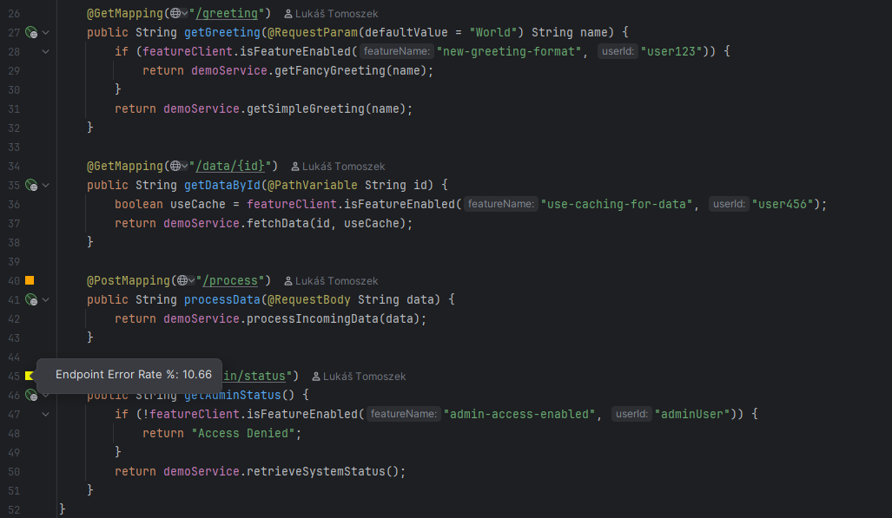
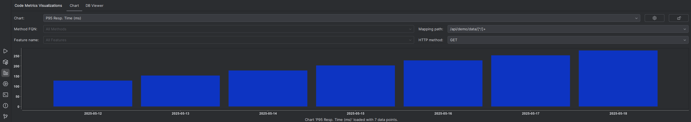
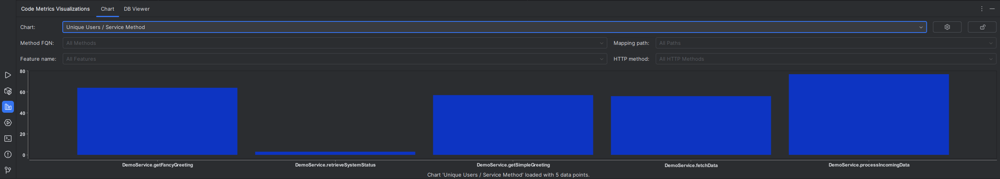

# Production Code Metrics Visualization
[](https://github.com/lukas-tomoszek/idea-code-metrics-visualization/actions/workflows/build.yml)
[](https://plugins.jetbrains.com/plugin/27403)
[](https://plugins.jetbrains.com/plugin/27403)

## Table of Contents

- [Overview](#overview)
- [Key Features](#key-features)
- [Getting Started](#getting-started)
- [Detailed Feature Breakdown](#detailed-feature-breakdown)
- [Placeholders](#placeholders)
- [Building from Source](#building-from-source)
- [Technology Stack](#technology-stack)
- [Acknowledgements](#acknowledgements)
- [License](#license)

## Overview

<!-- Plugin description -->
**Production Code Metrics Visualization** is an IntelliJ IDEA plugin that brings log and metrics data directly into your
development workflow. It lets you import, query, and visualize data (e.g., method call counts, error rates, performance
data, feature flag usage) through configurable charts in a dedicated tool window and as insightful line markers right
next to your Java code.

## Key Features

- **Embedded DuckDB:** Stores and queries imported metrics in a local DuckDB database within your project.
- **Data Sources:** Import data from various sources (e.g., CSV, Parquet, JSON) using DuckDB specific SQL.
- **Context-Aware Line Markers:** Show metric values (e.g., error count, usage rate) inline in the editor gutter, with
  color rules based on SQL results and code context.
- **Custom Charts:** Visualize time series or categorical metrics in a dedicated tool window using SQL-based queries and
  filters.
- **Dynamic Placeholders:** Use context-aware placeholders in SQL templates to scope results to the current code or
  file.
- **LLM Prompt Generator:** Copy AI-ready prompts that include table samples and placeholder instructions to generate
  import queries, line markers, or charts.
- **Integrated DB Viewer:** Browse and query the in-project DuckDB database directly inside IntelliJ IDEA.

<!-- Plugin description end -->

See [Detailed Feature Breakdown](#detailed-feature-breakdown) for configuration details and advanced usage.

## Getting Started

1. **Install the Plugin:**  
   Install from the [JetBrains Marketplace](https://plugins.jetbrains.com/plugin/27403)  
   via `Settings → Plugins → Marketplace`,  
   or [download the ZIP (v1.0.0)](https://github.com/lukas-tomoszek/idea-code-metrics-visualization/releases/download/v1.0.0/idea-code-metrics-visualization-1.0.0.zip) 
   and use `Install Plugin from Disk`.
2. **Open Settings/Preferences:** Navigate to `Tools -> Production Code Metrics Visualization`.
3. **Configure Data Sources:**
    - Add a new data source with a name, target table, and import SQL.
    - (Optional) Use LLM tools to help generate the SQL based on file sample and instructions.
    - After saving, click the **Run Import SQL Now** button (green triangle) in the toolbar.
4. **Validate Imported Data:**
    - Open the **Code Metrics Visualizations** tool window.
    - Switch to the **DB Viewer** tab to inspect the imported tables.
    - You can browse data, check row counts, and run custom `SELECT` queries to verify everything loaded correctly.
5. **(Optional) Configure Feature Evaluators:**
    - Define how to recognize feature flag checks in your code.
6. **Configure Line Markers:**
    - Add marker configurations with an SQL template and color rules.
    - Use placeholders like `#method_fqn#` to scope values dynamically.
7. **Configure Charts:**
    - Add SQL-based chart configs for time series or categorical data (e.g., bar charts).
8. **View Visualizations:**
    - **Line Markers:** Appear inline next to methods, feature calls, or Spring mappings.
    - **Tool Window:** Open the **Code Metrics Visualizations** tab to view configured charts.

## Demo Project

You can explore the plugin using the companion demo repository:  
[idea-code-metrics-visualization-demo](https://github.com/lukas-tomoszek/idea-code-metrics-visualization-demo)

This project includes:

- A sample Spring Boot application.
- Scripts to generate example data (Apache access logs, application activity, user feature assignments).
- Pre-configured plugin settings for data sources, line markers, and charts.

It is designed to showcase the plugin's capabilities with minimal setup. Follow the usage guide in the demo repo for
step-by-step instructions.

Example line markers and charts from the demo project:

**Controller Error Rate Line Markers**  


**P95 Response Time Chart**  


**Unique Users per Method Chart**  


## Detailed Feature Breakdown

### Data Sources

* **Purpose:** Import external metrics (e.g., logs, telemetry, structured files) into DuckDB tables for querying.

* **Configuration Fields:**
    - `Name`: Unique identifier for the data source.
    - `Table Name`: Used for table management (e.g., DROP) and to guide LLM prompt generation. The actual table created
      depends entirely on the SQL.
    - `Import SQL`: SQL statement that performs the import (e.g., `CREATE TABLE AS SELECT * FROM read_csv(...)`). This
      is the only field used during execution.
    - `File Path`: (Optional) Path to the input file, used only for LLM prompt generation.
    - `Import Mode`: (Optional) Describes your intended strategy (`REPLACE` or `APPEND`), used only for LLM prompt
      generation.
    - `LLM Additional Info`: (Optional) Custom notes to guide the LLM (e.g., column types, renames, filters).


* **Actions:**
    - **Copy LLM Prompt for SQL Generation**: Copies a prompt generated from your configuration, file sample (if
      available), and import context.
    - **Run Import SQL Now**: Executes the SQL (after saving) to create/populate the DuckDB table.
    - **Drop Table**: Deletes the associated DuckDB table.
    - **Delete Configuration**: Removes the data source config and drops the associated table (with confirmation).

### Feature Evaluators

* **Purpose:** Recognize feature flag evaluation calls in your code to enable use of the `#feature_name#` placeholder in
  SQL queries.

* **Configuration Fields:**
    - `Name`: Unique identifier for the evaluator configuration.
    - `Evaluator Method FQN`: Fully qualified name of the method that evaluates feature flags (e.g.,
      `com.my.FeatureClient.isEnabled`).
    - `Feature Parameter Index`: Zero-based index of the parameter holding the feature name (e.g., in
      `featureClient.isEnabled(user, "my-feature", default)`, the index is `1`)
    - `Feature Parameter Type`: Type of the feature identifier (`STRING` or `ENUM_CONSTANT`).

### Line Markers

* **Purpose:** Display metrics directly in the editor gutter (next to methods, feature calls, or Spring mappings) as
  colored icons.

* **Configuration Fields:**
    - `Name`: Unique name for the marker.
    - `Enabled`: Whether the marker is active. (set in the table, not in the dialog).
    - `SQL Template`: A DuckDB SQL query that must return a **single numerical value**.
        - See [Placeholders](#placeholders) for dynamic values and behavior.
    - `Rules`: One rule per line in the format `from_exclusive;to_inclusive;color_hex_or_empty`. Rules are evaluated
      top-down; the first match applies.
        - Empty boundaries mean unbounded.
        - Empty color means no marker is shown.

        - Example:
          ```
          ;10;#00FF00  
          10;50;#FFFF00  
          50;;#FF0000  
          ```
    - `LLM Description`: Natural language description of the metric logic.
    - `LLM Relevant Table Names`: One or more tables to include in the LLM prompt sample.

* **Actions:**
    - **Copy LLM Prompt for SQL & Rules**: Copies a prompt using your config and sample table data to help generate or
      refine both the SQL and color rules.

* **Provider Types (i.e., where the marker appears):**
    - **Method Definition**: Applies when the SQL uses `#method_fqn#`, but **not** `#feature_name#` or any Spring
      mapping placeholders.
    - **Feature Evaluation**: Applies when the SQL uses `#feature_name#`, and a matching **Feature Evaluator** is
      configured.
    - **Spring Mapping**: Applies when the SQL uses `#mapping_path#` or `#mapping_method#`, and **does not** use
      `#feature_name#`.

### Charts

* **Purpose:** Visualize metrics as category charts in the **Code Metrics Visualizations** tool window.

* **Configuration Fields:**
    - `Name`: Unique identifier for the chart.
    - `SQL Template`: DuckDB SQL query that must return **two columns**:
        - First: X-axis values (string or date/time)
        - Second: Y-axis values (numeric)
        - See [Placeholders](#placeholders) for dynamic values and behavior.
    - `LLM Description`: Optional natural language description to help generate the SQL.
    - `LLM Relevant Table Names`: Tables to include in the LLM prompt for schema/sample guidance.

* **Rendering Details:**
    - X-axis labels rotate automatically if there are many (> 20).
    - Labels are hidden if there are too many (> 100).
    - Date/time values are auto-formatted using one of:
        - `HH:mm:ss` (for time-only)
        - `yyyy-MM-dd` (for date-only)
        - `MM-dd HH:mm` (for full timestamps)

* **Actions:**
    - **Copy LLM Prompt for SQL Generation**: Copies a prompt using your SQL description and table samples for
      AI-assisted generation.
* **Interactivity:**
    - Use dynamic placeholders in your SQL (e.g., `#method_fqn#`, `#feature_name#`, `#mapping_path#`) to make the chart
      respond to the active file or selection.
    - In the tool window, select a chart and use filters (method, feature, path, HTTP method) to update the chart
      context.
    - Lock/unlock filters to either stay fixed or follow the current **caret position** in the editor.

### DB Viewer

* **Purpose:** Explore and validate data stored in the embedded DuckDB instance.

* **Features:**
    - Browse available tables using a dropdown.
    - View table contents with column names and types.
    - Run custom `SELECT` queries using an interactive SQL field.
        - The default query includes `LIMIT 100`, but you can modify or remove it.
        - Removing the limit on large tables may freeze the UI.
    - Use query results to verify successful imports and debug chart or line marker configurations.
    - The viewer is read-only. To create or modify tables, use a Data Source configuration.

## Placeholders

You can include the following placeholders in your SQL templates for Line Markers and Charts:

### Context Placeholders (Single Entity)

- `#method_fqn#`: Fully qualified method name at caret  
  _Example:_ `com.example.service.UserService.getUsers`

- `#feature_name#`: Feature flag string at caret (if matched by evaluator)  
  _Example:_ `new-homepage-feature`

- `#mapping_path#`: Resolved Spring mapping path  
  _Example:_ `/api/orders/[^/]+/confirm`

- `#mapping_method#`: HTTP method of the Spring mapping  
  _Example:_ `POST`

### File-Wide Placeholders (Multi-Entity)

- `#method_fqns_in_file#`: Comma-separated list of method FQNs in the current file  
  _Example:_ `'com.example.Foo.a','com.example.Bar.b'`

- `#feature_names_in_file#`: Comma-separated list of feature names in the current file  
  _Example:_ `'beta-login','dark-mode-toggle'`

- `#mapping_paths_in_file#`: Regex alternation of all Spring mapping paths in the file  
  _Example:_ `/users/[^/]+|/orders|/users/[^/]+/file/[^/]+`

- `#mapping_methods_in_file#`: Comma-separated HTTP methods used in mappings in the file  
  _Example:_ `'GET','PUT','POST'`

### Behavior

- Placeholders must match your use case (e.g., feature markers require `#feature_name#`).
- **Line Markers** require all placeholders to be resolved from the current caret context. If any are missing, the
  marker is not shown.
- **Charts** support fallback values when the user selects **"All ..."** in a filter:
    - `'%'` is used for `LIKE`-compatible placeholders (e.g., `#method_fqn#`, `#feature_name#`, `#mapping_method#`)
    - `'.*'` is used for regex-compatible placeholders (e.g., `#mapping_path#`)
- **File-wide placeholders** are replaced with:
    - A comma-separated list of quoted values (for use in `IN (...)`)
    - A regex alternation string (for `REGEXP_MATCHES(...)`)
    - `NULL` if the corresponding list is empty, to safely support both patterns

## Building from Source

* **Prerequisites:** JDK 21 (JetBrains Runtime or any standard JDK).
* **Clone the repository.**
* **Build the plugin:** Run `./gradlew buildPlugin` from the project root.
* **Output:** The plugin artifact will be located in `build/distributions/`.

## Technology Stack

* **IntelliJ Platform SDK:** For IDE integration.
* **Kotlin:** Primary programming language.
* **DuckDB:** Embedded analytical database for metrics.
* **XChart:** Library for plotting charts.
* **Gradle:** Build automation.

## Acknowledgements

Icons used in this plugin are from the [IntelliJ Platform Icons](https://intellij-icons.jetbrains.design/) project by
JetBrains, licensed under the [Apache 2.0 License](https://www.apache.org/licenses/LICENSE-2.0).

## License

This project is licensed under the Apache License, Version 2.0. See the [LICENSE](LICENSE) file for details.

---

Plugin based on the [IntelliJ Platform Plugin Template](https://github.com/JetBrains/intellij-platform-plugin-template).
